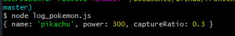

# My first script on node

### Run this command in your terminal (need to place on this folder in terminal)

```bash
node log_pokemon.js
```

### Node will run the file content and show you the results




I made this readme reading this [cheatsheet](https://github.com/adam-p/markdown-here/wiki/Markdown-Cheatsheet)
